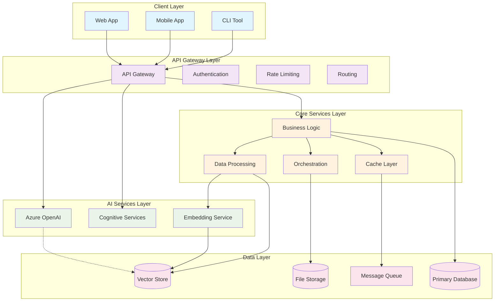

# System Architecture Template

## Document Overview

### Purpose

[Describe the purpose of this architecture document]

### Scope

[Define the boundaries of the system being architected]

### Audience

[List who should read and use this document - developers, architects, ops team]

## Executive Summary

### Architecture Overview

[High-level description of the system architecture]

### Key Architectural Decisions

1. **Decision**: [e.g., Microservices vs Monolithic]
   - **Rationale**: [Why this decision was made]
   - **Alternatives Considered**: [Other options evaluated]
   - **Trade-offs**: [Benefits and drawbacks]

2. **Decision**: [e.g., Azure Container Apps for hosting]
   - **Rationale**: [Why this decision was made]
   - **Alternatives Considered**: [Other options evaluated]
   - **Trade-offs**: [Benefits and drawbacks]

### Technology Stack Summary

- **Cloud Platform**: Azure
- **Container Platform**: Azure Container Apps
- **AI Services**: Azure OpenAI, Cognitive Services
- **Database**: [Primary database technology]
- **Programming Languages**: [Backend and frontend languages]
- **CI/CD**: GitHub Actions with Azure Container Registry

## System Context

### Business Context

[How this system fits into the broader business ecosystem]

### Technical Context

[How this system fits into the existing technical landscape]

### System Boundaries

#### In Scope

- [ ] Component/Service 1
- [ ] Component/Service 2
- [ ] Component/Service 3

#### Out of Scope

- [ ] External System A (existing)
- [ ] External System B (separate project)
- [ ] Future Enhancement C

### External Dependencies

| Dependency   | Type       | Purpose        | SLA Requirements | Risk Level |
| ------------ | ---------- | -------------- | ---------------- | ---------- |
| Azure OpenAI | AI Service | LLM processing | 99.9% uptime     | Medium     |
| [System]     | [Type]     | [Purpose]      | [SLA]            | [Risk]     |

## High-Level Architecture

### Architecture Style

[Description of overall architectural approach - microservices, event-driven,
etc.]

### System Architecture Diagram



### Core Components

#### Component 1: [Component Name]

- **Purpose**: [What this component does]
- **Responsibilities**: [Key functions]
- **Technology**: [Implementation technology]
- **Interfaces**: [How other components interact with it]
- **Scaling Strategy**: [How it scales]

#### Component 2: [Component Name]

[Repeat format above for each major component]

## Detailed Architecture

### Application Architecture

#### Frontend Architecture

- **Framework**: [React, Vue.js, etc.]
- **State Management**: [Redux, Vuex, etc.]
- **Build Tools**: [Webpack, Vite, etc.]
- **Deployment**: [Static hosting, CDN, etc.]

#### Backend Architecture

- **Framework**: [Express.js, FastAPI, .NET Core, etc.]
- **Architecture Pattern**: [MVC, Clean Architecture, etc.]
- **API Design**: [RESTful, GraphQL, etc.]
- **Authentication**: [JWT, OAuth 2.0, etc.]

#### AI Architecture

##### AI Agent Design

```
AI Orchestrator
├── Document Analysis Agent
│   ├── Text Extraction
│   ├── Content Parsing
│   └── Metadata Extraction
├── Question Answering Agent
│   ├── Query Processing
│   ├── Context Retrieval
│   └── Response Generation
├── Summarization Agent
│   ├── Content Analysis
│   ├── Key Point Extraction
│   └── Summary Generation
└── Content Generation Agent
    ├── Template Processing
    ├── Content Creation
    └── Format Optimization
```

##### RAG (Retrieval-Augmented Generation) Pipeline

1. **Document Ingestion**
   - Text extraction from various formats
   - Content chunking and preprocessing
   - Metadata extraction and tagging

2. **Embedding Generation**
   - Text-to-vector conversion
   - Embedding model: [Specific model used]
   - Batch processing for efficiency

3. **Vector Storage**
   - Vector database: [Azure Cognitive Search, etc.]
   - Indexing strategy
   - Search optimization

4. **Query Processing**
   - Query understanding and enhancement
   - Semantic search execution
   - Context ranking and selection

5. **Response Generation**
   - LLM prompt construction
   - Response generation and validation
   - Citation and source linking

### Data Architecture

#### Data Flow Diagram

```
[Insert data flow diagram showing how data moves through the system]

Example:
User Input → Input Validation → AI Processing → Result Caching → Response Formatting → User Output
     ↓              ↓                ↓              ↓               ↓
  Audit Log → Security Scan → Token Usage → Performance Metrics → Analytics
```

#### Data Storage

##### Primary Database

- **Technology**: [PostgreSQL, SQL Server, etc.]
- **Purpose**: [Application data, user management, etc.]
- **Schema Design**: [Relational, normalized, etc.]
- **Backup Strategy**: [Point-in-time recovery, etc.]

##### Vector Database

- **Technology**: [Azure Cognitive Search, Pinecone, etc.]
- **Purpose**: [Semantic search, embeddings storage]
- **Index Strategy**: [Partitioning, optimization]
- **Performance Tuning**: [Query optimization, caching]

##### File Storage

- **Technology**: [Azure Blob Storage, etc.]
- **Purpose**: [Document storage, media files]
- **Organization**: [Container structure, naming conventions]
- **Access Patterns**: [Hot, cool, archive tiers]

##### Cache Layer

- **Technology**: [Redis, Azure Cache, etc.]
- **Purpose**: [Response caching, session storage]
- **Caching Strategy**: [Cache-aside, write-through, etc.]
- **TTL Policies**: [Different expiration times by data type]

#### Data Security

- **Encryption at Rest**: [AES-256, key management]
- **Encryption in Transit**: [TLS 1.3, certificate management]
- **Access Control**: [RBAC, attribute-based access]
- **Data Classification**: [Public, internal, confidential, restricted]

### Integration Architecture

#### Internal Service Communication

- **Communication Pattern**: [Synchronous/Asynchronous]
- **Protocol**: [HTTP/REST, gRPC, message queues]
- **Service Discovery**: [Method for services to find each other]
- **Circuit Breakers**: [Fault tolerance patterns]

#### External System Integration

| System   | Integration Type | Data Format | Authentication  | Error Handling   |
| -------- | ---------------- | ----------- | --------------- | ---------------- |
| [System] | [REST API/etc.]  | [JSON/XML]  | [OAuth/API Key] | [Retry/Fallback] |

#### Event-Driven Architecture (if applicable)

- **Message Broker**: [Azure Service Bus, Event Hub, etc.]
- **Event Types**: [Domain events, integration events]
- **Event Sourcing**: [If using event sourcing pattern]
- **CQRS**: [If using command-query separation]

## Infrastructure Architecture

### Cloud Infrastructure

#### Azure Services Used

| Service            | Purpose             | Configuration      | Scaling              | Cost Optimization     |
| ------------------ | ------------------- | ------------------ | -------------------- | --------------------- |
| Container Apps     | Application hosting | [Specs]            | [Auto-scaling rules] | [Cost measures]       |
| Container Registry | Image storage       | [Config]           | [Replication]        | [Retention policies]  |
| OpenAI Service     | AI processing       | [Model/deployment] | [Quota management]   | [Usage monitoring]    |
| Key Vault          | Secrets management  | [Access policies]  | [Replication]        | [Usage-based billing] |

#### Network Architecture

- **Virtual Networks**: [VNet configuration and segmentation]
- **Subnets**: [Subnet design and security groups]
- **Load Balancing**: [Application Gateway, Load Balancer config]
- **DNS**: [Domain management and resolution]
- **CDN**: [Content delivery network setup]

#### Security Architecture

- **Identity & Access Management**: [Azure AD integration]
- **Network Security**: [NSGs, firewalls, DDoS protection]
- **Secrets Management**: [Azure Key Vault usage]
- **Monitoring & Auditing**: [Security monitoring tools]

### Container Architecture

#### Container Strategy

- **Base Images**: [Official images, security scanning]
- **Multi-stage Builds**: [Build optimization]
- **Image Layering**: [Efficient layer management]
- **Security**: [Non-root users, minimal attack surface]

#### Container Orchestration

- **Platform**: Azure Container Apps
- **Scaling Policies**: [CPU/memory-based, queue-based]
- **Health Checks**: [Liveness and readiness probes]
- **Resource Management**: [CPU/memory limits and requests]

### Deployment Architecture

#### Environment Strategy

| Environment | Purpose             | Infrastructure      | Data                   | Deployment Trigger      |
| ----------- | ------------------- | ------------------- | ---------------------- | ----------------------- |
| Development | Feature development | [Minimal resources] | [Sample data]          | [Manual/feature branch] |
| Staging     | Integration testing | [Production-like]   | [Anonymized prod data] | [Main branch]           |
| Production  | Live system         | [Full resources]    | [Production data]      | [Tagged releases]       |

#### CI/CD Pipeline

```
GitHub Repository
├── Feature Branch → Development Environment
├── Main Branch → Staging Environment
└── Release Tag → Production Environment

Pipeline Stages:
1. Code Checkout
2. Dependency Installation
3. Code Quality Checks (linting, security scan)
4. Unit Tests
5. Build Container Image
6. Integration Tests
7. Push to Container Registry
8. Deploy to Target Environment
9. Smoke Tests
10. Notifications
```

## Non-Functional Architecture

### Performance Architecture

#### Performance Requirements

- **Response Time**: [Target response times for different operations]
- **Throughput**: [Requests per second targets]
- **Concurrent Users**: [Maximum concurrent user support]
- **Resource Utilization**: [CPU, memory, storage targets]

#### Performance Optimization Strategies

- **Caching**: [Multi-level caching strategy]
- **Database Optimization**: [Indexing, query optimization]
- **CDN**: [Static content delivery]
- **Compression**: [Response compression]
- **Connection Pooling**: [Database and external service connections]

### Scalability Architecture

#### Horizontal Scaling

- **Stateless Design**: [Ensuring services can scale horizontally]
- **Load Balancing**: [Distribution strategies]
- **Database Scaling**: [Read replicas, sharding if needed]
- **Auto-scaling**: [Metrics-based scaling rules]

#### Vertical Scaling

- **Resource Monitoring**: [CPU, memory, storage monitoring]
- **Capacity Planning**: [Growth projections and resource planning]
- **Performance Testing**: [Load testing strategies]

### Reliability Architecture

#### High Availability

- **Redundancy**: [Multi-region, multi-zone deployment]
- **Failover**: [Automatic failover procedures]
- **Health Monitoring**: [Health checks and monitoring]
- **SLA Targets**: [Uptime and performance SLAs]

#### Disaster Recovery

- **Backup Strategy**: [Automated backups, retention policies]
- **Recovery Procedures**: [RTO and RPO targets]
- **Data Replication**: [Cross-region data replication]
- **Testing**: [Regular DR testing procedures]

#### Fault Tolerance

- **Circuit Breakers**: [Service failure handling]
- **Retry Policies**: [Exponential backoff, retry limits]
- **Graceful Degradation**: [Reduced functionality during issues]
- **Bulkhead Pattern**: [Isolating critical resources]

## Security Architecture

### Security Model

[Overall approach to security - defense in depth, zero trust, etc.]

### Authentication & Authorization

- **User Authentication**: [Method and flow]
- **Service Authentication**: [Service-to-service auth]
- **Authorization Model**: [RBAC, ABAC, etc.]
- **Token Management**: [JWT, refresh tokens, etc.]

### Data Protection

- **Data Classification**: [Sensitivity levels and handling]
- **Encryption**: [At rest and in transit]
- **Key Management**: [Key rotation, storage]
- **Data Loss Prevention**: [Monitoring and controls]

### Application Security

- **Input Validation**: [Preventing injection attacks]
- **Output Encoding**: [XSS prevention]
- **Session Management**: [Secure session handling]
- **API Security**: [Rate limiting, validation]

### Infrastructure Security

- **Network Security**: [Firewalls, segmentation]
- **Container Security**: [Image scanning, runtime protection]
- **Secrets Management**: [Secure storage and rotation]
- **Compliance**: [Regulatory requirements]

## Monitoring & Observability

### Monitoring Strategy

[Overall approach to monitoring and observability]

### Application Monitoring

- **Metrics**: [Application-specific metrics to track]
- **Logging**: [Log levels, structured logging]
- **Tracing**: [Distributed tracing implementation]
- **Alerting**: [Alert conditions and escalation]

### Infrastructure Monitoring

- **Resource Monitoring**: [CPU, memory, storage, network]
- **Service Health**: [Health checks and status monitoring]
- **Performance Monitoring**: [Response times, throughput]
- **Security Monitoring**: [Security events and anomalies]

### AI-Specific Monitoring

- **Model Performance**: [Accuracy, drift detection]
- **Token Usage**: [Cost monitoring and optimization]
- **Response Quality**: [User feedback and quality metrics]
- **Bias Detection**: [Fairness and bias monitoring]

## Quality Attributes

### Performance

- **Latency**: [Response time requirements and targets]
- **Throughput**: [Transaction volume handling]
- **Resource Efficiency**: [Optimal resource utilization]

### Scalability

- **User Scalability**: [Concurrent user support]
- **Data Scalability**: [Data volume handling]
- **Geographic Scalability**: [Multi-region support]

### Reliability

- **Availability**: [Uptime requirements]
- **Fault Tolerance**: [Failure handling capabilities]
- **Recovery**: [Disaster recovery capabilities]

### Security

- **Confidentiality**: [Data protection measures]
- **Integrity**: [Data integrity assurance]
- **Availability**: [Secure access assurance]

### Maintainability

- **Modularity**: [Component independence]
- **Testability**: [Testing strategy and coverage]
- **Debuggability**: [Troubleshooting capabilities]

## Architecture Decisions (ADRs)

### ADR-001: [Decision Title]

- **Status**: [Proposed/Accepted/Deprecated/Superseded]
- **Date**: [Decision date]
- **Context**: [Situation requiring decision]
- **Decision**: [What was decided]
- **Consequences**: [Results of the decision]

### ADR-002: [Decision Title]

[Repeat format above for additional decisions]

## Deployment & Operations

### Deployment Strategy

- **Deployment Pattern**: [Blue-green, rolling, canary]
- **Environment Promotion**: [How code moves through environments]
- **Rollback Strategy**: [How to handle failed deployments]
- **Database Migrations**: [Schema change management]

### Operational Procedures

- **Monitoring Procedures**: [How to monitor system health]
- **Incident Response**: [How to handle incidents]
- **Maintenance Procedures**: [Regular maintenance tasks]
- **Backup Procedures**: [Data backup and restore processes]

## Risk Assessment

### Technical Risks

1. **Risk**: [e.g., AI service availability]
   - **Impact**: [Potential consequences]
   - **Probability**: [Likelihood]
   - **Mitigation**: [How to reduce risk]
   - **Contingency**: [Backup plan]

### Operational Risks

[Continue format above for operational risks]

### Security Risks

[Continue format above for security risks]

## Quality Gates

### Architecture Phase Quality Gates

- [ ] Architecture aligns with business requirements
- [ ] All quality attributes are addressed
- [ ] Security architecture is comprehensive
- [ ] Performance requirements can be met
- [ ] Scalability strategy is sound
- [ ] Technology choices are justified
- [ ] Dependencies are identified and managed
- [ ] Risks are assessed with mitigation plans
- [ ] Monitoring and observability are planned
- [ ] Deployment strategy is defined

### Approval Checklist

- [ ] Senior architect review and approval
- [ ] Security architect approval
- [ ] Infrastructure team approval
- [ ] Development team consensus
- [ ] Operations team agreement

## Document Information

- **Created By**: [Name and role]
- **Creation Date**: [Date]
- **Last Updated**: [Date]
- **Version**: 1.0
- **Document Status**: [Draft/Under Review/Approved]
- **Next Review Date**: [Date]

## Appendices

### Appendix A: Detailed Component Designs

[More detailed designs for complex components]

### Appendix B: API Specifications

[Detailed API documentation]

### Appendix C: Database Schema

[Detailed database design]

### Appendix D: Security Controls Matrix

[Mapping of security controls to threats]

### Appendix E: Performance Benchmarks

[Expected performance characteristics]
