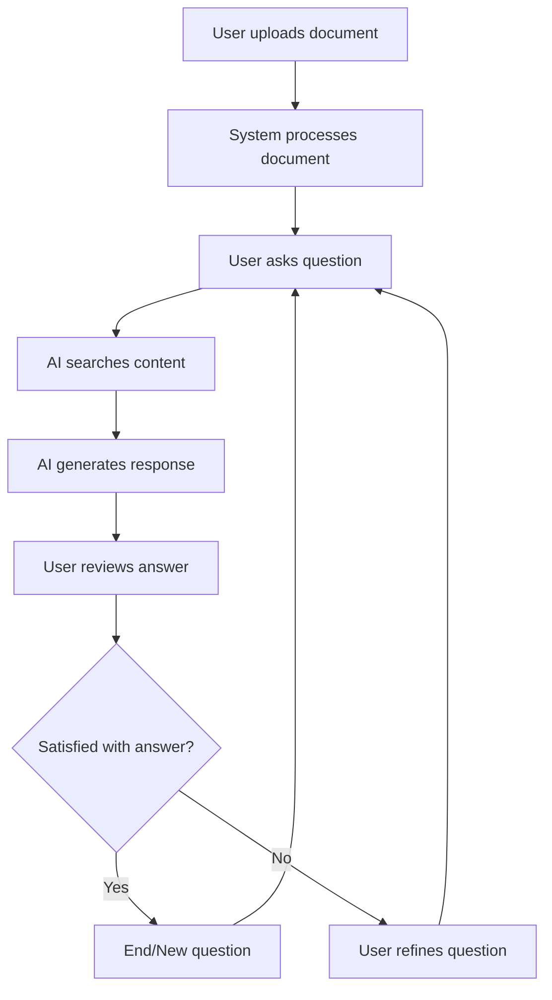

# User Experience Template

## Document Overview

### Purpose

[Describe the purpose of this UX design document]

### Scope

[Define what user interfaces and interactions are covered]

### Audience

[List who should read this - UX designers, developers, product managers]

## UX Strategy

### Design Philosophy

[Overall approach to user experience design]

#### Core UX Principles

1. **Principle 1**: [e.g., AI Transparency - Users should understand when and
   how AI is involved]
2. **Principle 2**: [e.g., Progressive Disclosure - Show complexity only when
   needed]
3. **Principle 3**: [e.g., Human-AI Collaboration - AI augments rather than
   replaces human judgment]

#### AI-Specific UX Considerations

- **Explainability**: [How AI decisions are communicated to users]
- **Trust Building**: [How to build user confidence in AI recommendations]
- **Error Recovery**: [How users can correct or override AI mistakes]
- **Learning Feedback**: [How system learns from user interactions]

### Target User Analysis

#### Primary User Persona: [Persona Name]

- **Demographics**: [Age, role, technical background]
- **Goals**: [What they want to achieve]
- **Pain Points**: [Current challenges]
- **Behaviors**: [How they currently work]
- **Technology Comfort**: [Comfort level with AI/new tools]
- **Context of Use**: [When/where they use the system]
- **Success Metrics**: [How they measure success]

#### Secondary User Personas

[Repeat format above for additional user types]

### User Journey Mapping

#### Current State Journey: [Primary User]

```
[Document the current process without your system]

Example:
1. Receive documents via email
2. Download and save to local folder
3. Open each document manually
4. Read through entire document
5. Take notes in separate application
6. Search for specific information
7. Create summary document
8. Share findings with team

Pain Points:
- Time-consuming manual process
- Difficulty finding specific information
- Inconsistent note-taking
- No easy way to cross-reference documents
```

#### Future State Journey: [Primary User]

```
[Document the improved process with your system]

Example:
1. Upload documents to AI assistant
2. Ask questions in natural language
3. Receive instant answers with citations
4. Generate automated summaries
5. Create study guides or FAQ
6. Share insights with team
7. Continue conversations over time

Benefits:
- 80% time reduction
- Consistent, reliable information
- Automatic source attribution
- Easy knowledge sharing
```

### User Experience Goals

#### Primary UX Goals

1. **Goal**: [e.g., Reduce time to find information]
   - **Current State**: [e.g., 15 minutes to find specific fact]
   - **Target State**: [e.g., <30 seconds to get answer]
   - **Measurement**: [How to measure success]

2. **Goal**: [e.g., Increase user confidence in results]
   - **Current State**: [Current confidence level]
   - **Target State**: [Target confidence level]
   - **Measurement**: [User surveys, usage patterns]

#### Secondary UX Goals

[Continue format above for additional goals]

## Information Architecture

### Site Map / Navigation Structure

```
Application Root
├── Dashboard
│   ├── Recent Documents
│   ├── Recent Conversations
│   └── Quick Actions
├── Documents
│   ├── Document Library
│   ├── Upload New Document
│   └── Document Details
│       ├── Content View
│       ├── AI Analysis
│       └── Generated Outputs
├── Conversations
│   ├── Chat Interface
│   ├── Conversation History
│   └── Conversation Analytics
├── AI Studio
│   ├── Summaries
│   ├── Study Guides
│   ├── FAQ Generation
│   ├── Mind Maps
│   └── Audio Overviews
└── Settings
    ├── User Preferences
    ├── AI Configuration
    └── Account Management
```

### Content Strategy

#### Content Hierarchy

[How information is organized and prioritized]

#### Content Types

| Content Type     | Purpose            | User Need                | Priority |
| ---------------- | ------------------ | ------------------------ | -------- |
| Document Content | Source material    | Reference information    | High     |
| AI Responses     | Generated insights | Quick answers            | High     |
| Navigation       | Wayfinding         | Task completion          | Medium   |
| Help Content     | User guidance      | Learning/troubleshooting | Medium   |

### User Flow Design

#### Core User Flow: Document Q&A



#### Flow: Document Upload & Processing

1. **Entry Point**: Dashboard or Documents page
2. **User Action**: Click "Upload Document" or drag & drop
3. **System Response**: Show upload progress
4. **Processing State**: Display processing status with progress indicator
5. **Completion**: Confirm successful processing and available actions
6. **Error Handling**: Clear error messages with suggested solutions

#### Flow: AI Conversation

1. **Entry Point**: Chat interface or document detail page
2. **User Action**: Type question or select suggested question
3. **System Response**: Show "thinking" indicator
4. **Result Display**: Present answer with citations and confidence
5. **Follow-up**: Suggest related questions or actions
6. **Context Preservation**: Maintain conversation history

## Interface Design

### Design System

#### Visual Design Principles

- **Clarity**: [Clean, uncluttered interface]
- **Consistency**: [Uniform patterns across all screens]
- **Accessibility**: [WCAG 2.1 AA compliance]
- **AI Transparency**: [Clear indicators when AI is working]

#### Color Palette

| Color          | Hex     | Usage          | Accessibility |
| -------------- | ------- | -------------- | ------------- |
| Primary Blue   | #0066CC | Actions, links | AAA compliant |
| Success Green  | #00AA44 | Confirmations  | AAA compliant |
| Warning Orange | #FF6600 | Alerts         | AA compliant  |
| Error Red      | #CC0000 | Errors         | AAA compliant |
| Neutral Gray   | #666666 | Text, borders  | AAA compliant |

#### Typography Scale

| Style   | Font Size | Line Height | Usage              |
| ------- | --------- | ----------- | ------------------ |
| H1      | 32px      | 40px        | Page titles        |
| H2      | 24px      | 32px        | Section headers    |
| H3      | 20px      | 28px        | Subsection headers |
| Body    | 16px      | 24px        | Regular text       |
| Caption | 14px      | 20px        | Metadata, labels   |

#### Spacing System

- **Base Unit**: 8px
- **Component Padding**: 16px (2 units)
- **Section Margins**: 24px (3 units)
- **Page Margins**: 32px (4 units)

### Component Library

#### Basic Components

##### Button Component

```typescript
interface ButtonProps {
  variant: 'primary' | 'secondary' | 'tertiary' | 'danger';
  size: 'small' | 'medium' | 'large';
  loading?: boolean;
  disabled?: boolean;
  icon?: React.ReactNode;
  children: React.ReactNode;
  onClick: () => void;
}

// Usage examples:
<Button variant="primary" size="medium">Upload Document</Button>
<Button variant="secondary" loading={true}>Processing...</Button>
<Button variant="tertiary" icon={<QuestionIcon />}>Ask Question</Button>
```

##### Input Component

```typescript
interface InputProps {
  type: 'text' | 'email' | 'password' | 'search';
  label: string;
  placeholder?: string;
  value: string;
  onChange: (value: string) => void;
  error?: string;
  helpText?: string;
  required?: boolean;
  disabled?: boolean;
}
```

##### AI Response Component

```typescript
interface AIResponseProps {
  response: string;
  citations: Citation[];
  confidence: number;
  timestamp: Date;
  loading?: boolean;
  onCitationClick: (citation: Citation) => void;
  onFeedback: (rating: 'positive' | 'negative') => void;
}
```

#### Specialized Components

##### Document Card

```typescript
interface DocumentCardProps {
  document: Document;
  actions: DocumentAction[];
  showPreview?: boolean;
  onAction: (action: string, document: Document) => void;
}

// Features:
// - Document thumbnail or icon
// - Title, upload date, size
// - Processing status indicator
// - Quick action buttons
// - Preview on hover
```

##### Chat Interface

```typescript
interface ChatInterfaceProps {
  messages: Message[];
  onSendMessage: (message: string) => void;
  suggestedQuestions?: string[];
  isTyping?: boolean;
  documentContext?: Document[];
}

// Features:
// - Message bubbles with role indicators
// - Typing indicators
// - Suggested questions
// - File attachment support
// - Message timestamps
```

##### AI Confidence Indicator

```typescript
interface ConfidenceIndicatorProps {
  confidence: number; // 0-100
  showLabel?: boolean;
  size: 'small' | 'medium' | 'large';
}

// Visual representation:
// - Progress bar or gauge
// - Color coding (red/yellow/green)
// - Tooltip with explanation
```

### Screen Designs

#### Dashboard Screen

**Purpose**: Central hub for user activities and quick access to key features

**Layout**:

```
┌─────────────────────────────────────────────────────────────┐
│ Header: Logo, Navigation, User Menu                         │
├─────────────────────────────────────────────────────────────┤
│ Welcome Message & Quick Stats                               │
├─────────────────────────────────────────────────────────────┤
│ ┌─────────────────┐  ┌─────────────────┐  ┌──────────────┐ │
│ │   Recent Docs   │  │ Recent Chats    │  │ Quick Actions│ │
│ │                 │  │                 │  │              │ │
│ │ • Document 1    │  │ • Conversation  │  │ [Upload Doc] │ │
│ │ • Document 2    │  │ • Conversation  │  │ [New Chat]   │ │
│ │ • Document 3    │  │ • Conversation  │  │ [View All]   │ │
│ └─────────────────┘  └─────────────────┘  └──────────────┘ │
├─────────────────────────────────────────────────────────────┤
│ AI Assistant Quick Access                                   │
│ ┌─────────────────────────────────────────────────────────┐ │
│ │ "Ask me anything about your documents..." [Ask Question]│ │
│ └─────────────────────────────────────────────────────────┘ │
└─────────────────────────────────────────────────────────────┘
```

**Key Features**:

- Overview of recent activity
- Quick access to common actions
- Search functionality
- Status indicators for document processing

#### Document Library Screen

**Purpose**: Manage and organize uploaded documents

**Layout**:

```
┌─────────────────────────────────────────────────────────────┐
│ Header + Navigation                                         │
├─────────────────────────────────────────────────────────────┤
│ Page Title: "Documents" [Upload New] [Import from URL]     │
├─────────────────────────────────────────────────────────────┤
│ Filters: [All] [PDFs] [Word] [Processing] [Completed]      │
│ Search: [Search documents...] Sort: [Most Recent ▼]        │
├─────────────────────────────────────────────────────────────┤
│ Document Grid/List View                                     │
│ ┌─────────┐ ┌─────────┐ ┌─────────┐ ┌─────────┐            │
│ │[Icon]   │ │[Icon]   │ │[Icon]   │ │[Icon]   │            │
│ │Doc 1    │ │Doc 2    │ │Doc 3    │ │Doc 4    │            │
│ │2MB PDF  │ │1MB DOCX │ │5MB PDF  │ │Processing│            │
│ │[View]   │ │[View]   │ │[View]   │ │[Status] │            │
│ └─────────┘ └─────────┘ └─────────┘ └─────────┘            │
└─────────────────────────────────────────────────────────────┘
```

**Key Features**:

- Grid or list view toggle
- Filtering and sorting options
- Bulk actions
- Upload progress indicators
- Document preview on hover

#### Chat Interface Screen

**Purpose**: Interactive Q&A with AI about documents

**Layout**:

```
┌─────────────────────────────────────────────────────────────┐
│ Header + Navigation                                         │
├─────────────────────────────────────────────────────────────┤
│ Chat Header: "Conversation with AI" [New Chat] [Settings]  │
├─────────────────────────────────────────────────────────────┤
│ ┌─────────────────┐ ┌─────────────────────────────────────┐ │
│ │ Context Panel   │ │ Chat Messages                       │ │
│ │                 │ │                                     │ │
│ │ Active Docs:    │ │ User: "What is the main topic?"     │ │
│ │ ☑ Document 1    │ │                                     │ │
│ │ ☑ Document 2    │ │ AI: "The main topic is..."         │ │
│ │ ☐ Document 3    │ │ [Citations: Doc1 p.5, Doc2 p.12]   │ │
│ │                 │ │ [Confidence: 92%] [👍👎]           │ │
│ │ Suggested Qs:   │ │                                     │ │
│ │ • "Summarize"   │ │ User: "Can you elaborate?"          │ │
│ │ • "Key points"  │ │                                     │ │
│ │ • "Timeline"    │ │ AI: [Typing indicator...]           │ │
│ └─────────────────┘ └─────────────────────────────────────┘ │
├─────────────────────────────────────────────────────────────┤
│ Input: [Type your question...] [📎] [Send]                 │
└─────────────────────────────────────────────────────────────┘
```

**Key Features**:

- Split-panel layout
- Document context management
- Message history
- Citation display
- Confidence indicators
- Typing indicators
- Suggested questions

#### AI Studio Screen

**Purpose**: Generate and manage AI-created content

**Layout**:

```
┌─────────────────────────────────────────────────────────────┐
│ Header + Navigation                                         │
├─────────────────────────────────────────────────────────────┤
│ AI Studio: Generate Content from Your Documents            │
├─────────────────────────────────────────────────────────────┤
│ Source Selection:                                           │
│ [Select Documents...] Selected: Document1.pdf, Document2.pdf│
├─────────────────────────────────────────────────────────────┤
│ Content Type Tabs: [Summary] [FAQ] [Timeline] [Mind Map]   │
├─────────────────────────────────────────────────────────────┤
│ Generation Options:                                         │
│ Length: ◉ Brief ○ Medium ○ Detailed                        │
│ Style: ◉ Professional ○ Academic ○ Casual                  │
│ [Generate Content]                                          │
├─────────────────────────────────────────────────────────────┤
│ Generated Content:                                          │
│ ┌─────────────────────────────────────────────────────────┐ │
│ │ ## Executive Summary                                    │ │
│ │                                                         │ │
│ │ The documents analyze the current market trends...     │ │
│ │                                                         │ │
│ │ ### Key Findings                                        │ │
│ │ • Finding 1 (Source: Doc1, p.3)                       │ │
│ │ • Finding 2 (Source: Doc2, p.7)                       │ │
│ │                                                         │ │
│ │ [Export] [Edit] [Regenerate] [Share]                   │ │
│ └─────────────────────────────────────────────────────────┘ │
└─────────────────────────────────────────────────────────────┘
```

### Responsive Design

#### Breakpoints

| Device  | Width      | Layout Changes                      |
| ------- | ---------- | ----------------------------------- |
| Mobile  | <768px     | Single column, collapsed navigation |
| Tablet  | 768-1024px | Two columns, condensed interface    |
| Desktop | >1024px    | Full layout, all features visible   |

#### Mobile Adaptations

- **Navigation**: Hamburger menu with slide-out sidebar
- **Chat Interface**: Full-screen modal for conversations
- **Document Library**: Card-based layout with simplified actions
- **AI Studio**: Wizard-style interface with step-by-step flow

### Accessibility Design

#### WCAG 2.1 AA Compliance

- **Color Contrast**: All text meets minimum contrast ratios
- **Keyboard Navigation**: Full keyboard accessibility
- **Screen Reader Support**: Proper ARIA labels and landmarks
- **Focus Management**: Clear focus indicators and logical tab order

#### Accessibility Features

```typescript
// Example: Accessible button component
<Button
  aria-label="Upload new document"
  aria-describedby="upload-help-text"
  role="button"
  tabIndex={0}
>
  Upload Document
</Button>

// Screen reader announcements for AI responses
<div
  role="region"
  aria-live="polite"
  aria-label="AI Response"
>
  {aiResponse}
</div>
```

#### Keyboard Shortcuts

| Shortcut | Action            | Context        |
| -------- | ----------------- | -------------- |
| Ctrl+U   | Upload document   | Global         |
| Ctrl+/   | Focus search      | Global         |
| Enter    | Send message      | Chat interface |
| Escape   | Close modal       | Modal dialogs  |
| Tab      | Navigate elements | Global         |

### Micro-Interactions

#### AI Processing States

1. **Idle State**: Ready for input
2. **Processing State**: Animated "thinking" indicator
3. **Success State**: Smooth reveal of results
4. **Error State**: Gentle shake animation with error message

#### Feedback Mechanisms

- **Loading States**: Progress indicators for document processing
- **Success Confirmations**: Brief toast notifications
- **Error Handling**: Inline error messages with suggested actions
- **AI Confidence**: Visual confidence meters with explanations

#### Animation Guidelines

- **Duration**: 200-300ms for most transitions
- **Easing**: Ease-out for entrances, ease-in for exits
- **Purpose**: All animations should have functional purpose
- **Accessibility**: Respect `prefers-reduced-motion` settings

### Error Handling UX

#### Error Categories

1. **User Errors**: Input validation, file format issues
2. **System Errors**: Service unavailable, timeout
3. **AI Errors**: Low confidence, processing failures

#### Error Message Design

```typescript
interface ErrorMessageProps {
  type: 'warning' | 'error' | 'info';
  title: string;
  description: string;
  action?: {
    label: string;
    onClick: () => void;
  };
  onDismiss?: () => void;
}

// Example usage:
<ErrorMessage
  type="error"
  title="Document Processing Failed"
  description="The file format is not supported. Please upload a PDF, DOCX, or TXT file."
  action={{
    label: "Try Again",
    onClick: () => openFileSelector()
  }}
/>
```

#### Error Recovery Patterns

- **Retry Mechanisms**: Automatic retry with exponential backoff
- **Alternative Paths**: Suggest alternative actions when primary fails
- **Graceful Degradation**: Reduced functionality when services unavailable
- **Progress Preservation**: Save user work during error states

### Performance UX

#### Loading States

- **Document Upload**: Progress bar with percentage and estimated time
- **AI Processing**: Indeterminate spinner with descriptive text
- **Search Results**: Skeleton screens while loading

#### Perceived Performance

- **Optimistic Updates**: Show immediate feedback before server confirmation
- **Progressive Loading**: Load critical content first, details later
- **Caching Indicators**: Show when results are from cache vs. fresh

#### Performance Budgets

- **Page Load**: <3 seconds for initial load
- **AI Response**: <10 seconds for complex queries
- **Document Processing**: Progress indication for operations >5 seconds

## User Testing Strategy

### Testing Methods

1. **Usability Testing**: Task-based testing with target users
2. **A/B Testing**: Compare different interface approaches
3. **Accessibility Testing**: Screen reader and keyboard-only testing
4. **Performance Testing**: Test on various devices and connections

### Test Scenarios

#### Scenario 1: First-Time User Onboarding

- **Goal**: Successfully upload first document and ask first question
- **Success Criteria**: Task completion within 5 minutes
- **Metrics**: Completion rate, time to completion, error rate

#### Scenario 2: Expert User Workflow

- **Goal**: Upload multiple documents and generate comprehensive analysis
- **Success Criteria**: Efficient use of advanced features
- **Metrics**: Feature adoption, workflow completion time

### Success Metrics

| Metric               | Target     | Measurement Method    |
| -------------------- | ---------- | --------------------- |
| Task Completion Rate | >90%       | User testing sessions |
| Time to First Value  | <2 minutes | Analytics tracking    |
| User Satisfaction    | >4.5/5     | Post-session surveys  |
| Error Rate           | <5%        | Error analytics       |

## Quality Gates

### UX Phase Quality Gates

- [ ] User personas are research-based and detailed
- [ ] User journeys map to business requirements
- [ ] Information architecture supports user goals
- [ ] Interface designs follow accessibility guidelines
- [ ] Responsive design works across all target devices
- [ ] Micro-interactions enhance usability
- [ ] Error handling provides clear recovery paths
- [ ] Performance considerations are addressed
- [ ] Testing strategy is comprehensive
- [ ] Success metrics are defined and measurable

### Approval Checklist

- [ ] UX designer sign-off
- [ ] Product manager approval
- [ ] Accessibility specialist review
- [ ] Development team feasibility confirmation
- [ ] Stakeholder alignment on user experience

## Document Information

- **Created By**: [Name and role]
- **Creation Date**: [Date]
- **Last Updated**: [Date]
- **Version**: 1.0
- **Document Status**: [Draft/Under Review/Approved]
- **Next Review Date**: [Date]

## Appendices

### Appendix A: User Research Data

[Detailed user research findings and insights]

### Appendix B: Wireframes and Mockups

[Detailed visual designs and prototypes]

### Appendix C: Accessibility Audit

[Detailed accessibility compliance documentation]

### Appendix D: Usability Test Results

[Test session recordings and analysis]
