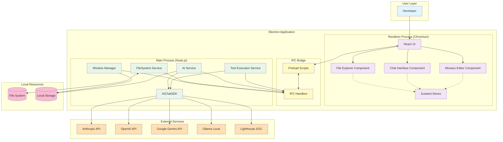

# Lighthouse Chat IDE - System Architecture

## Document Overview

### Purpose

This document defines the complete system architecture for Lighthouse Chat IDE (Beacon), including technology stack, system components, deployment architecture, data models, and technical design decisions. It provides the blueprint for implementing the requirements defined in 03-Business-Requirements.md while maintaining extensibility for future enhancements.

### Scope

This architecture document covers:
- High-level system architecture and component relationships
- Technology stack selection and rationale
- Electron application architecture (main process, renderer process, IPC)
- Component design with SOLID principles
- State management patterns using Zustand
- File operation tooling and AI integration architecture
- Data models and type system
- Security architecture and sandboxing
- Performance considerations and optimizations
- Extension points for future phases

This document does NOT cover:
- Detailed implementation guides (separate per-phase documentation)
- Deployment and operations (future documentation)
- Testing strategies (separate test plans)
- Specific business requirements (see 03-Business-Requirements.md)

### Audience

- **Development Team**: Primary audience for implementation
- **Technical Architects**: Review and validation of design decisions
- **Product Owner**: Understanding technical approach and trade-offs
- **QA Engineers**: Understanding architecture for test planning
- **Future Maintainers**: Reference for extending or modifying system

## Executive Summary

### Architecture Overview

Lighthouse Chat IDE is built as an **Electron desktop application** with a **three-layer architecture**:

1. **Main Process Layer** (Node.js runtime): Handles file system operations, AI service coordination, and IPC management
2. **Renderer Process Layer** (React UI): Provides visual IDE interface with file explorer, AI chat, and code editor
3. **Shared Layer**: Common types, interfaces, and constants used across processes

The architecture follows **SOLID principles** throughout, with clear separation of concerns, dependency injection, and interface-based programming enabling extensibility for future phases.

**Key Architectural Patterns**:
- **Service-oriented architecture** in main process (FileSystemService, AIService, ToolExecutionService)
- **Component-based UI** with React hooks and functional components
- **State management** via Zustand (lightweight, minimal boilerplate)
- **IPC bridge pattern** for secure main/renderer communication
- **Provider pattern** for multi-AI provider support
- **Tool execution loop** for conversational file operations

### Key Architectural Decisions

#### 1. Decision: Electron as Desktop Platform

- **Rationale**:
  - **Full filesystem access**: Required for file operation tools (read, write, edit, delete)
  - **Proven at scale**: Powers VS Code, Slack, Discord, GitHub Desktop
  - **Cross-platform**: Single codebase for macOS, Windows, Linux
  - **Modern web stack**: React + TypeScript + modern tooling
  - **Mature ecosystem**: Extensive documentation, libraries, patterns
- **Alternatives Considered**:
  - Native applications (Swift/Kotlin/C++): Separate codebases, longer development, harder maintenance
  - Browser-based with File System Access API: Limited browser support, reduced capabilities
  - Tauri (Rust + web): Newer, smaller ecosystem, less proven at scale
- **Trade-offs**:
  - **Benefit**: Full capabilities, cross-platform, familiar web technologies
  - **Drawback**: Larger application size (~200MB), more memory usage than native

#### 2. Decision: React + TypeScript for UI

- **Rationale**:
  - **React**: De facto standard for complex UIs, excellent ecosystem, hooks enable clean patterns
  - **TypeScript**: Type safety prevents bugs, better IDE support, self-documenting code
  - **Functional components**: Modern React approach, easier testing, better performance
  - **Industry standard**: Vast talent pool, extensive resources, proven patterns
- **Alternatives Considered**:
  - Vue.js: Smaller ecosystem for Electron, less industry momentum
  - Angular: Heavier framework, more opinionated, less Electron integration
  - Svelte: Newer, smaller ecosystem, less proven at scale
- **Trade-offs**:
  - **Benefit**: Mature ecosystem, extensive resources, type safety, developer productivity
  - **Drawback**: React bundle size, learning curve for TypeScript

#### 3. Decision: Zustand for State Management

- **Rationale**:
  - **Lightweight**: Minimal boilerplate compared to Redux (~1KB vs ~15KB)
  - **Simple API**: Easy to learn, no actions/reducers/middleware complexity
  - **TypeScript-first**: Excellent type inference and safety
  - **Hook-based**: Integrates naturally with React hooks
  - **No context provider tree**: Cleaner component hierarchy
- **Alternatives Considered**:
  - Redux: Too much boilerplate for our needs, overkill for this scale
  - MobX: More magic, less explicit, harder to debug
  - React Context: Performance issues with frequent updates, prop drilling alternative only
- **Trade-offs**:
  - **Benefit**: Simplicity, less code, easier maintenance, good performance
  - **Drawback**: Less structured than Redux for very large applications (not a concern for our scope)

#### 4. Decision: Monaco Editor for Code Editing

- **Rationale**:
  - **VS Code engine**: Same editor that powers VS Code, proven quality
  - **Feature-complete**: Syntax highlighting, IntelliSense, diff view, all built-in
  - **Excellent TypeScript support**: First-class TypeScript integration
  - **Large file support**: Handles files up to 10MB+ efficiently
  - **Free and open source**: Microsoft-maintained, actively developed
- **Alternatives Considered**:
  - CodeMirror: Good editor, but less feature-complete, would need more custom development
  - ACE Editor: Older, less actively maintained, fewer features
  - Custom editor: Massive development effort, wouldn't match Monaco quality
- **Trade-offs**:
  - **Benefit**: Professional editor with minimal implementation effort, matches VS Code UX
  - **Drawback**: Larger bundle size (~3MB), some features we don't need

#### 5. Decision: AIChatSDK for AI Integration

- **Rationale**:
  - **Multi-provider abstraction**: Handles Claude, GPT, Gemini, Ollama with unified interface
  - **SOC logging built-in**: Automatic traceability for all AI operations
  - **Compliance scanning**: PCI/HIPAA detection integrated
  - **Lighthouse-owned**: Internal control, can modify if needed
  - **Proven in other projects**: Already used successfully in Lighthouse ecosystem
- **Alternatives Considered**:
  - Direct AI provider SDKs: Would need to implement multi-provider abstraction ourselves
  - LangChain: Overkill for our needs, complex, large dependency tree
  - Custom implementation: Months of development, wouldn't have SOC/compliance features
- **Trade-offs**:
  - **Benefit**: Ready-made multi-provider support, SOC/compliance included, Lighthouse-aligned
  - **Drawback**: Dependency on internal SDK (mitigated by local clone, can fork if needed)

#### 6. Decision: Vite as Build Tool

- **Rationale**:
  - **Fast HMR**: Sub-second hot module replacement for development
  - **Modern**: ESM-first, optimized for modern browsers
  - **Excellent Electron support**: electron-vite plugin well-maintained
  - **TypeScript-native**: First-class TypeScript support, no configuration
  - **Industry momentum**: Replacing Webpack as modern standard
- **Alternatives Considered**:
  - Webpack: Slower build times, complex configuration, older technology
  - esbuild directly: Faster but less integrated ecosystem, more manual setup
  - Rollup: Good but Vite is Rollup under the hood with better DX
- **Trade-offs**:
  - **Benefit**: Development speed, modern tooling, excellent DX
  - **Drawback**: Newer than Webpack, slightly smaller ecosystem (but growing rapidly)

### Technology Stack Summary

- **Cloud Platform**: None (desktop application)
- **Desktop Platform**: Electron (latest stable)
- **Container Platform**: N/A (not containerized)
- **AI Services**: Anthropic Claude, OpenAI GPT, Google Gemini, Ollama (via AIChatSDK)
- **Database**: None (local file storage in Electron userData directory)
- **Programming Languages**: TypeScript (strict mode), Node.js runtime
- **UI Framework**: React 18+
- **State Management**: Zustand
- **Build Tool**: Vite
- **Code Editor**: Monaco Editor
- **Package Manager**: pnpm

## System Context

### Business Context

Lighthouse Chat IDE addresses the need for conversational AI-powered development with complete visual context and enterprise governance. It fits into the broader Lighthouse ecosystem as:

- **Primary development tool** for Lighthouse consultants and developers
- **Demonstration of AI capabilities** for enterprise clients
- **Validation of multi-provider architecture** for future Lighthouse AI products
- **SOC traceability showcase** for regulated industry clients
- **Component of agentic development workflow** integrated with wave-based planning

The system enables developers to interact with codebases through natural language while maintaining full visual awareness of file structure and changes, differentiating Lighthouse from competitors through integrated AI + IDE + governance.

### Technical Context

Lighthouse Chat IDE operates in the developer's local environment with the following technical context:

- **Local filesystem**: Direct access to project files on developer's machine
- **AI provider APIs**: External HTTPS calls to Anthropic, OpenAI, Google, or local Ollama server
- **AIChatSDK**: Local module imported from adjacent directory (../AIChatSDK)
- **SOC system**: Logs sent to Lighthouse SOC via AIChatSDK (HTTPS or internal protocol)
- **Electron platform**: Node.js runtime for main process, Chromium for renderer
- **Operating system**: macOS, Windows, or Linux (Electron cross-platform)

**No external services required** except AI provider APIs (user-initiated). All data stored locally on user's machine except AI requests and SOC logs.

### System Boundaries

#### In Scope

- [x] Electron application (main process, renderer process, preload scripts)
- [x] File explorer UI component with tree view
- [x] Monaco editor UI component with tabs
- [x] AI chat UI component with streaming
- [x] File operation tools (read, write, edit, delete, glob, grep, bash)
- [x] Permission system and safety controls
- [x] AIChatSDK integration (multi-provider AI)
- [x] IPC communication layer
- [x] State management (Zustand stores)
- [x] Local storage (conversations, settings)
- [x] SOC logging via AIChatSDK

#### Out of Scope

- [ ] Web browser version (future enhancement)
- [ ] Cloud infrastructure or backend services
- [ ] Real-time collaboration features
- [ ] Built-in git UI (use bash tool or external git client)
- [ ] Integrated debugger (use external debugger)
- [ ] Package management UI (use terminal)
- [ ] Custom model training or fine-tuning
- [ ] Central user authentication (desktop app, no login)

### External Dependencies

| Dependency | Type | Purpose | SLA Requirements | Risk Level |
|------------|------|---------|------------------|------------|
| Anthropic Claude API | AI Service | LLM for file operations | Best effort (user's API key) | Medium |
| OpenAI API | AI Service | Alternative LLM provider | Best effort (user's API key) | Medium |
| Google Gemini API | AI Service | Alternative LLM provider | Best effort (user's API key) | Medium |
| Ollama | Local AI Service | Local model hosting | User-managed | Low |
| AIChatSDK | Internal SDK | AI provider abstraction | Lighthouse-maintained | Low |
| Electron | Framework | Desktop application platform | Open source, stable | Low |
| Monaco Editor | Component | Code editor | Microsoft-maintained | Low |
| Node.js | Runtime | JavaScript/TypeScript runtime | LTS support | Low |

## High-Level Architecture

### Architecture Style

**Service-Oriented Electron Application** with clear separation between:

1. **Main Process** (Node.js): Business logic services (file system, AI coordination, tool execution)
2. **Renderer Process** (React): UI components and user interaction
3. **IPC Bridge**: Secure communication between main and renderer
4. **Shared Layer**: Common types and interfaces

**Design Patterns**:
- **SOLID principles** throughout codebase
- **Dependency injection** for services
- **Provider pattern** for AI providers
- **Observer pattern** for state updates (Zustand)
- **Strategy pattern** for tool execution
- **Command pattern** for file operations

### System Architecture Diagram



### Component Overview

#### Renderer Process Components (UI Layer)

| Component | Responsibility | Technology | Phase |
|-----------|---------------|------------|-------|
| **MainLayout** | Three-panel layout management | React + TailwindCSS | Phase 1 |
| **FileExplorer** | Directory tree display and navigation | React + Zustand | Phase 1 |
| **MonacoEditor** | Code editing with syntax highlighting | Monaco Editor + React | Phase 1 |
| **ChatInterface** | AI conversation and streaming | React + Zustand | Phase 2 |
| **PermissionPrompt** | Approve/deny file operations | React Modal | Phase 2 |
| **DiffView** | Visual diff with accept/reject | Monaco Diff Editor | Phase 5 |
| **SettingsPanel** | Configuration UI | React + Zustand | Phase 4 |

#### Main Process Services (Business Logic Layer)

| Service | Responsibility | Technology | Phase |
|---------|---------------|------------|-------|
| **WindowManager** | Electron window lifecycle | Electron BrowserWindow | Phase 1 |
| **FileSystemService** | File I/O operations | Node.js fs/promises | Phase 1 |
| **AIService** | AI provider coordination | AIChatSDK | Phase 2 |
| **ToolExecutionService** | File operation tool execution | Custom + AIChatSDK | Phase 3 |
| **PermissionService** | Operation approval logic | Custom | Phase 2 |
| **SettingsService** | Configuration persistence | Electron store | Phase 4 |

#### Shared Layer (Common Code)

| Module | Responsibility | Used By |
|--------|---------------|---------|
| **IPC Types** | Type-safe IPC channel definitions | Main + Renderer |
| **Domain Types** | File system, editor, chat types | Main + Renderer |
| **Constants** | IPC channels, config values | Main + Renderer |
| **Interfaces** | AI service, tool interfaces | Main (extensibility) |

## Detailed Architecture

### Main Process Architecture

The main process runs in Node.js and has full access to system resources. It follows a **service-oriented architecture** with dependency injection.

#### Window Manager

**Responsibility**: Manage Electron window lifecycle

```typescript
// src/main/window-manager.ts
interface IWindowManager {
  createMainWindow(): BrowserWindow;
  getMainWindow(): BrowserWindow | null;
  closeAllWindows(): void;
}

class WindowManager implements IWindowManager {
  private mainWindow: BrowserWindow | null = null;

  createMainWindow(): BrowserWindow {
    this.mainWindow = new BrowserWindow({
      width: 1920,
      height: 1080,
      webPreferences: {
        preload: path.join(__dirname, '../preload/index.js'),
        nodeIntegration: false, // Security: no Node in renderer
        contextIsolation: true,  // Security: isolated context
        sandbox: true,           // Security: sandboxed renderer
      },
    });

    this.mainWindow.loadFile('index.html'); // Vite builds this

    this.mainWindow.on('closed', () => {
      this.mainWindow = null;
    });

    return this.mainWindow;
  }

  getMainWindow(): BrowserWindow | null {
    return this.mainWindow;
  }

  closeAllWindows(): void {
    BrowserWindow.getAllWindows().forEach(window => window.close());
  }
}

export const windowManager = new WindowManager();
```

#### FileSystem Service

**Responsibility**: All file system operations with validation and security

```typescript
// src/main/services/file-system.service.ts
import * as fs from 'fs/promises';
import * as path from 'path';

interface IFileSystemService {
  readDirectory(dirPath: string): Promise<DirectoryEntry[]>;
  readFile(filePath: string): Promise<FileContent>;
  writeFile(filePath: string, content: string): Promise<void>;
  deleteFile(filePath: string): Promise<void>;
  validatePath(targetPath: string): boolean;
}

class FileSystemService implements IFileSystemService {
  private projectRoot: string | null = null;

  setProjectRoot(rootPath: string): void {
    this.projectRoot = path.resolve(rootPath);
  }

  validatePath(targetPath: string): boolean {
    // Security: Prevent operations outside project directory
    const resolved = path.resolve(targetPath);
    return this.projectRoot && resolved.startsWith(this.projectRoot);
  }

  async readDirectory(dirPath: string): Promise<DirectoryEntry[]> {
    if (!this.validatePath(dirPath)) {
      throw new Error('Access denied: Path outside project directory');
    }

    const entries = await fs.readdir(dirPath, { withFileTypes: true });

    return entries.map(entry => ({
      name: entry.name,
      path: path.join(dirPath, entry.name),
      type: entry.isDirectory() ? 'directory' : 'file',
    }));
  }

  async readFile(filePath: string): Promise<FileContent> {
    if (!this.validatePath(filePath)) {
      throw new Error('Access denied: Path outside project directory');
    }

    const content = await fs.readFile(filePath, 'utf-8');
    const stats = await fs.stat(filePath);

    return {
      path: filePath,
      data: content,
      encoding: 'utf-8',
      size: stats.size,
    };
  }

  async writeFile(filePath: string, content: string): Promise<void> {
    if (!this.validatePath(filePath)) {
      throw new Error('Access denied: Path outside project directory');
    }

    await fs.writeFile(filePath, content, 'utf-8');
  }

  async deleteFile(filePath: string): Promise<void> {
    if (!this.validatePath(filePath)) {
      throw new Error('Access denied: Path outside project directory');
    }

    const stats = await fs.stat(filePath);
    if (stats.isDirectory()) {
      await fs.rmdir(filePath, { recursive: true });
    } else {
      await fs.unlink(filePath);
    }
  }
}

export const fileSystemService = new FileSystemService();
```

#### IPC Handlers

**Responsibility**: Bridge main process services to renderer via IPC

```typescript
// src/main/ipc/handlers.ts
import { ipcMain } from 'electron';
import { IPC_CHANNELS } from '@/shared/constants/ipc-channels';
import { fileSystemService } from '@/main/services/file-system.service';

export function registerIPCHandlers(): void {
  // File System handlers
  ipcMain.handle(IPC_CHANNELS.FS_READ_DIRECTORY, async (_, dirPath: string) => {
    try {
      return await fileSystemService.readDirectory(dirPath);
    } catch (error) {
      console.error('Error reading directory:', error);
      throw error;
    }
  });

  ipcMain.handle(IPC_CHANNELS.FS_READ_FILE, async (_, filePath: string) => {
    try {
      return await fileSystemService.readFile(filePath);
    } catch (error) {
      console.error('Error reading file:', error);
      throw error;
    }
  });

  ipcMain.handle(IPC_CHANNELS.FS_WRITE_FILE, async (_, filePath: string, content: string) => {
    try {
      await fileSystemService.writeFile(filePath, content);
      return { success: true };
    } catch (error) {
      console.error('Error writing file:', error);
      throw error;
    }
  });

  // More handlers registered in Phase 2+ (AI service, tool execution, etc.)
}
```

### Renderer Process Architecture

The renderer process runs React in Chromium and has **no direct Node.js access** (security). All system operations go through IPC.

#### State Management (Zustand)

**FileExplorerStore**:

```typescript
// src/renderer/stores/file-explorer.store.ts
import { create } from 'zustand';
import { ipcService } from '@/renderer/services/ipc.service';

interface FileExplorerState {
  rootPath: string | null;
  expandedFolders: Set<string>;
  selectedFile: string | null;
  directoryTree: DirectoryNode | null;
  isLoading: boolean;

  // Actions
  setRootPath: (path: string) => Promise<void>;
  toggleFolder: (path: string) => void;
  selectFile: (path: string) => void;
  refreshTree: () => Promise<void>;
}

export const useFileExplorerStore = create<FileExplorerState>((set, get) => ({
  rootPath: null,
  expandedFolders: new Set<string>(),
  selectedFile: null,
  directoryTree: null,
  isLoading: false,

  setRootPath: async (path: string) => {
    set({ isLoading: true, rootPath: path });
    try {
      const entries = await ipcService.readDirectory(path);
      const tree = buildDirectoryTree(entries, path);
      set({ directoryTree: tree, isLoading: false });
    } catch (error) {
      console.error('Error loading directory:', error);
      set({ isLoading: false });
    }
  },

  toggleFolder: (path: string) => {
    const { expandedFolders } = get();
    const newExpanded = new Set(expandedFolders);

    if (newExpanded.has(path)) {
      newExpanded.delete(path);
    } else {
      newExpanded.add(path);
    }

    set({ expandedFolders: newExpanded });
  },

  selectFile: (path: string) => {
    set({ selectedFile: path });
  },

  refreshTree: async () => {
    const { rootPath, setRootPath } = get();
    if (rootPath) {
      await setRootPath(rootPath);
    }
  },
}));
```

**EditorStore**:

```typescript
// src/renderer/stores/editor.store.ts
import { create } from 'zustand';
import { ipcService } from '@/renderer/services/ipc.service';

interface EditorFile {
  path: string;
  content: string;
  language: string;
  isDirty: boolean;
}

interface EditorState {
  openFiles: Map<string, EditorFile>;
  activeFileId: string | null;
  unsavedChanges: Set<string>;

  // Actions
  openFile: (path: string) => Promise<void>;
  closeFile: (path: string) => void;
  saveFile: (path: string) => Promise<void>;
  updateContent: (path: string, content: string) => void;
  setActiveFile: (path: string) => void;
}

export const useEditorStore = create<EditorState>((set, get) => ({
  openFiles: new Map<string, EditorFile>(),
  activeFileId: null,
  unsavedChanges: new Set<string>(),

  openFile: async (path: string) => {
    const { openFiles } = get();

    if (openFiles.has(path)) {
      set({ activeFileId: path });
      return;
    }

    try {
      const fileContent = await ipcService.readFile(path);
      const newFile: EditorFile = {
        path,
        content: fileContent.data,
        language: detectLanguage(path),
        isDirty: false,
      };

      const newOpenFiles = new Map(openFiles);
      newOpenFiles.set(path, newFile);

      set({ openFiles: newOpenFiles, activeFileId: path });
    } catch (error) {
      console.error('Error opening file:', error);
    }
  },

  closeFile: (path: string) => {
    const { openFiles, activeFileId, unsavedChanges } = get();

    // Prompt if unsaved changes
    if (unsavedChanges.has(path)) {
      const confirmed = confirm('File has unsaved changes. Close anyway?');
      if (!confirmed) return;
    }

    const newOpenFiles = new Map(openFiles);
    newOpenFiles.delete(path);

    const newUnsaved = new Set(unsavedChanges);
    newUnsaved.delete(path);

    // If closing active file, switch to another file or null
    const newActiveId = activeFileId === path
      ? (newOpenFiles.size > 0 ? Array.from(newOpenFiles.keys())[0] : null)
      : activeFileId;

    set({
      openFiles: newOpenFiles,
      activeFileId: newActiveId,
      unsavedChanges: newUnsaved,
    });
  },

  saveFile: async (path: string) => {
    const { openFiles, unsavedChanges } = get();
    const file = openFiles.get(path);

    if (!file) return;

    try {
      await ipcService.writeFile(path, file.content);

      const newOpenFiles = new Map(openFiles);
      newOpenFiles.set(path, { ...file, isDirty: false });

      const newUnsaved = new Set(unsavedChanges);
      newUnsaved.delete(path);

      set({ openFiles: newOpenFiles, unsavedChanges: newUnsaved });
    } catch (error) {
      console.error('Error saving file:', error);
    }
  },

  updateContent: (path: string, content: string) => {
    const { openFiles, unsavedChanges } = get();
    const file = openFiles.get(path);

    if (!file) return;

    const newOpenFiles = new Map(openFiles);
    newOpenFiles.set(path, { ...file, content, isDirty: true });

    const newUnsaved = new Set(unsavedChanges);
    newUnsaved.add(path);

    set({ openFiles: newOpenFiles, unsavedChanges: newUnsaved });
  },

  setActiveFile: (path: string) => {
    set({ activeFileId: path });
  },
}));
```

### Security Architecture

#### Electron Security Best Practices

**Implemented Security Measures**:

1. **Context Isolation**: Renderer has isolated JavaScript context (no access to Node.js)
2. **Preload Scripts**: Only exposed APIs defined in preload (principle of least privilege)
3. **No Node Integration**: `nodeIntegration: false` in renderer (prevents RCE attacks)
4. **Sandbox Mode**: Renderer runs in OS-level sandbox
5. **Content Security Policy**: CSP headers restrict resource loading
6. **IPC Validation**: All IPC calls validated in main process
7. **File Path Validation**: Prevent directory traversal attacks
8. **API Key Encryption**: Use Electron safeStorage for API keys

**Preload Script Example** (secure IPC exposure):

```typescript
// src/preload/index.ts
import { contextBridge, ipcRenderer } from 'electron';
import { IPC_CHANNELS } from '@/shared/constants/ipc-channels';

// Expose ONLY allowed IPC channels to renderer
contextBridge.exposeInMainWorld('electron', {
  invoke: (channel: string, ...args: any[]) => {
    // Whitelist allowed channels
    const allowedChannels = Object.values(IPC_CHANNELS);
    if (!allowedChannels.includes(channel)) {
      throw new Error(`IPC channel not allowed: ${channel}`);
    }
    return ipcRenderer.invoke(channel, ...args);
  },

  on: (channel: string, callback: (...args: any[]) => void) => {
    // Whitelist allowed channels for events
    const allowedChannels = [IPC_CHANNELS.AI_STREAM_MESSAGE];
    if (!allowedChannels.includes(channel)) {
      throw new Error(`IPC channel not allowed: ${channel}`);
    }
    ipcRenderer.on(channel, (_, ...args) => callback(...args));
  },
});
```

#### Permission System Architecture

**Permission Flow**:

```
1. User asks AI to modify file
2. AI suggests tool call (e.g., "write file")
3. ToolExecutionService intercepts tool call
4. PermissionService checks if approval needed
5. If needed: Show UI prompt in renderer (via IPC event)
6. User approves or denies in UI
7. Renderer sends approval/denial back (via IPC)
8. ToolExecutionService executes or aborts
9. Result sent to AI for next step
```

**Permission Service**:

```typescript
// src/main/services/permission.service.ts
interface PermissionRequest {
  id: string;
  toolName: string;
  filePath: string;
  operation: string;
  preview?: string;
}

class PermissionService {
  private pendingRequests: Map<string, PermissionRequest> = new Map();

  async requestPermission(request: PermissionRequest): Promise<boolean> {
    // Store request
    this.pendingRequests.set(request.id, request);

    // Send to renderer for UI prompt
    const mainWindow = windowManager.getMainWindow();
    if (!mainWindow) return false;

    mainWindow.webContents.send(IPC_CHANNELS.PERMISSION_REQUEST, request);

    // Wait for response (with timeout)
    return new Promise((resolve) => {
      const timeout = setTimeout(() => {
        this.pendingRequests.delete(request.id);
        resolve(false); // Default deny on timeout
      }, 60000); // 60 second timeout

      ipcMain.once(`permission-response-${request.id}`, (_, approved: boolean) => {
        clearTimeout(timeout);
        this.pendingRequests.delete(request.id);
        resolve(approved);
      });
    });
  }
}

export const permissionService = new PermissionService();
```

### Performance Considerations

#### File System Performance

- **Lazy loading**: Only load directory contents when folders expanded
- **File size limits**: Soft limit 1MB (warning), hard limit 10MB (reject)
- **Caching**: Cache directory listings for 5 seconds to reduce fs calls
- **Debouncing**: Debounce file watcher events (avoid excessive updates)

#### UI Performance

- **Virtual scrolling**: File explorer uses virtual scrolling for 1000+ files
- **Memoization**: React components memoized to prevent unnecessary re-renders
- **Code splitting**: Lazy load Phase 4+ components (settings, diff view)
- **Monaco optimization**: Use Monaco's built-in virtualization for large files

#### AI Streaming Performance

- **Incremental updates**: Update UI on each token chunk (smooth streaming)
- **Throttling**: Throttle UI updates to max 60fps (prevent jank)
- **Background processing**: Tool execution doesn't block AI streaming

## Data Models

### Core Type System

```typescript
// src/shared/types/file-system.types.ts
export interface DirectoryEntry {
  name: string;
  path: string;
  type: 'file' | 'directory';
  size?: number;
  modifiedAt?: Date;
}

export interface FileContent {
  path: string;
  data: string;
  encoding: string;
  size: number;
}

export interface DirectoryNode {
  name: string;
  path: string;
  type: 'file' | 'directory';
  children?: DirectoryNode[];
  isExpanded?: boolean;
}

// src/shared/types/editor.types.ts
export interface EditorFile {
  path: string;
  content: string;
  language: string;
  isDirty: boolean;
}

// src/shared/types/chat.types.ts
export interface ChatMessage {
  id: string;
  role: 'user' | 'assistant';
  content: string;
  timestamp: Date;
  toolCalls?: ToolCall[];
}

export interface ToolCall {
  id: string;
  name: string;
  parameters: Record<string, any>;
  result?: any;
  approved?: boolean;
}

// src/shared/types/ipc.types.ts
export interface IPCResponse<T = any> {
  success: boolean;
  data?: T;
  error?: string;
}
```

## Extension Points for Future Phases

### Phase 2: AI Integration

- **ChatStore**: Add to Zustand stores for conversation state
- **AIService**: New main process service for AI coordination
- **ChatInterface**: New renderer component for chat UI
- **AI IPC handlers**: New channels for sendMessage, streamMessage

### Phase 3: File Operation Tools

- **ToolExecutionService**: New main process service for tool execution
- **Tool schemas**: JSON schemas for each tool (read, write, edit, delete, glob, grep, bash)
- **Permission prompts**: UI components for approve/deny
- **Tool IPC handlers**: New channels for each tool type

### Phase 4: Multi-Provider Support

- **Provider abstraction**: Already in AIChatSDK, just configure multiple
- **SettingsStore**: New store for provider configuration
- **SettingsPanel**: New renderer component for settings UI
- **Settings persistence**: Save/load settings via Electron store

### Phase 5: Advanced Editor Features

- **DiffView component**: Use Monaco diff editor
- **Change management store**: Track pending AI changes
- **Accept/reject controls**: UI components for change review

### Phase 6: Polish and UX

- **Status bar component**: New UI component
- **Keyboard shortcuts**: Electron menu and accelerators
- **Theme system**: CSS variables for light/dark themes
- **Layout presets**: Saved layouts in settings

## Document Information

- **Created By**: Claude (AI Assistant) + Roy Love
- **Creation Date**: January 19, 2026
- **Last Updated**: January 19, 2026
- **Version**: 1.0 (Lighthouse IDF Artifact)
- **Next Review Date**: After Phase 1 implementation (validate architecture decisions)
- **Approval Status**: Draft - Awaiting Review
- **Source Documents**: PHASE-1-ARCHITECTURE.md, REQUIREMENTS.md
- **Related Documents**: 01-Product-Vision.md, 02-Product-Plan.md, 03-Business-Requirements.md, 05-User-Experience.md (pending)
